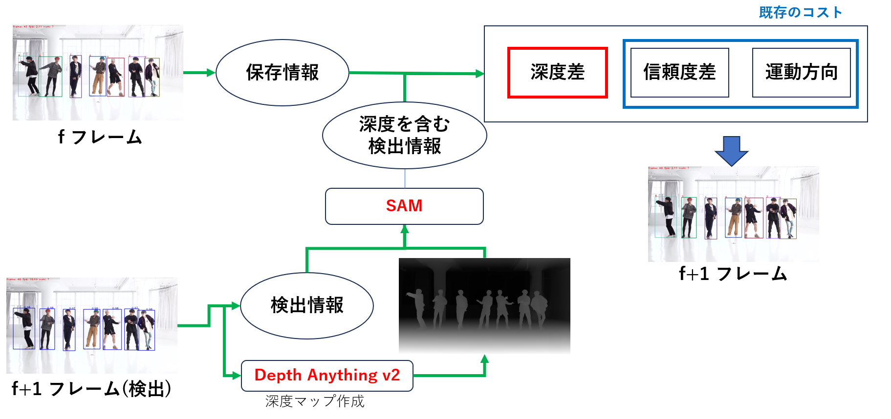

# DS-SORT

#### Hybrid-SORT is a simply and strong multi-object tracker.

> [**ssii2025投稿論文はこちら**](./usami.daiki_ssii2025.pdf)
> 

## Abstract

Multi-Object Tracking (MOT) aims to detect and associate all desired objects across frames. Most methods accomplish the task by explicitly or implicitly leveraging strong cues (i.e., spatial and appearance information), which exhibit powerful instance-level discrimination. However, when object occlusion and clustering occur, both spatial and appearance information will become ambiguous simultaneously due to the high overlap between objects. In this paper, we demonstrate that this long-standing challenge in MOT can be efficiently and effectively resolved by incorporating weak cues to compensate for strong cues. Along with velocity direction, we introduce the confidence state and height state as potential weak cues. With superior performance, our method still maintains Simple, Online and Real-Time (SORT) characteristics. Furthermore, our method shows strong generalization for diverse trackers and scenarios in a plug-and-play and training-free manner. Significant and consistent improvements are observed when applying our method to 5 different representative trackers. Further, by leveraging both strong and weak cues, our method Hybrid-SORT achieves superior performance on diverse benchmarks, including MOT17, MOT20, and especially DanceTrack where interaction and occlusion are frequent and severe.

### Pipeline

<center>

</center>


## Tracking performance

### Results on DanceTrack test set

| Tracker        | HOTA   | AssA   | IDF1   | IDSW  |
|----------------|:------:|:------:|:------:|:-----:|
| Hybrid SORT    | 62.124 | 47.333 | 62.801 | 1566  |
| 中心座標深度    | 60.761 | 45.203 | 61.462 | 1528  |
| 提案手法        | 63.315 | 48.909 | 64.396 | 1541  |

### Results on MOT17 challenge test set

| Tracker        | HOTA   | AssA   | IDF1   | IDSW  |
|----------------|:------:|:------:|:------:|:-----:|
| Hybrid SORT    | 62.98  | 62.89  | 78.00  | 2223  |
| 中心座標深度    | 63.27  | 63.42  | 78.18  | 1896  |
| 提案手法        | 63.09  | 63.04  | 78.13  | 2082  |

## 実行準備
CUDA=12.1, python3.8 torch1.11で実行
データの配置、事前学習モデル(pretrained)はベースラインとしてるHybrid SORTと同じです
checkpointsにdepth_anything_v2_vitl, sam_vit_h_4b8939 それぞれDepth Anything v2, SAMでダウンロードできます

### DanceTrack

**dancetrack-val dataset**

```
# Hybrid-SORT
python tools/run_hybrid_sort_dance.py -f exps/example/mot/yolox_dancetrack_val_hybrid_sort.py -b 1 -d 1 --fp16 --fuse --expn $exp_name 

# Hybrid-SORT-ReID
python tools/run_hybrid_sort_dance.py -f exps/example/mot/yolox_dancetrack_val_hybrid_sort_reid.py -b 1 -d 1 --fp16 --fuse --expn $exp_name
```

**dancetrack-test dataset**

```
# Hybrid-SORT
python tools/run_hybrid_sort_dance.py --test -f exps/example/mot/yolox_dancetrack_test_hybrid_sort.py -b 1 -d 1 --fp16 --fuse --expn $exp_name

# Hybrid-SORT-ReID
python tools/run_hybrid_sort_dance.py --test -f exps/example/mot/yolox_dancetrack_test_hybrid_sort_reid.py -b 1 -d 1 --fp16 --fuse --expn $exp_name
```

### MOT20

**MOT20-test dataset**

```
#Hybrid-SORT
python tools/run_hybrid_sort_dance.py -f exps/example/mot/yolox_x_mix_mot20_ch_hybrid_sort.py -b 1 -d 1 --fuse --mot20 --expn $exp_name 

#Hybrid-SORT-ReID
python tools/run_hybrid_sort_dance.py -f exps/example/mot/yolox_x_mix_mot20_ch_hybrid_sort_reid.py -b 1 -d 1 --fuse --mot20 --expn $exp_name
```

Hybrid-SORT is designed for online tracking, but offline interpolation has been demonstrated efficient for many cases and used by other online trackers. If you want to reproduct out result on  **MOT20-test** dataset, please use the linear interpolation over existing tracking results:

```shell
# offline post-processing
python3 tools/interpolation.py $result_path $save_path
```

### MOT17

**MOT17-val dataset**

```
# Hybrid-SORT
python3 tools/run_hybrid_sort_dance.py -f exps/example/mot/yolox_x_ablation_hybrid_sort.py -b 1 -d 1 --fuse --expn $exp_name 

# Hybrid-SORT-ReID
python3 tools/run_hybrid_sort_dance.py -f exps/example/mot/yolox_x_ablation_hybrid_sort_reid.py -b 1 -d 1 --fuse --expn  $exp_name 
```

**MOT17-test dataset**

```
# Hybrid-SORT
python3 tools/run_hybrid_sort_dance.py -f exps/example/mot/yolox_x_mix_det_hybrid_sort.py -b 1 -d 1 --fuse --expn $exp_name

# Hybrid-SORT-ReID
python3 tools/run_hybrid_sort_dance.py -f exps/example/mot/yolox_x_mix_det_hybrid_sort_reid.py -b 1 -d 1 --fuse --expn $exp_name
```

Hybrid-SORT is designed for online tracking, but offline interpolation has been demonstrated efficient for many cases and used by other online trackers. If you want to reproduct out result on  **MOT17-test** dataset, please use the linear interpolation over existing tracking results:

```shell
# offline post-processing
python3 tools/interpolation.py $result_path $save_path
```

### Demo

Hybrid-SORT, with the parameter settings of the dancetrack-val dataset

```
python3 tools/demo_track.py --demo_type image -f exps/example/mot/yolox_dancetrack_val_hybrid_sort.py -c pretrained/ocsort_dance_model.pth.tar --path ./datasets/dancetrack/val/dancetrack0079/img1 --fp16 --fuse --save_result
```

Hybrid-SORT-ReID, with the parameter settings of the dancetrack-val dataset

```
python3 tools/demo_track.py --demo_type image -f exps/example/mot/yolox_dancetrack_val_hybrid_sort_reid.py -c pretrained/ocsort_dance_model.pth.tar --path ./datasets/dancetrack/val/dancetrack0079/img1 --fp16 --fuse --save_result
```


