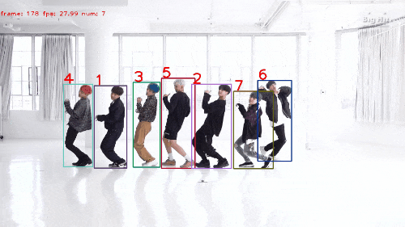
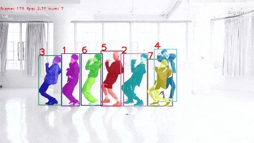

# DS-SORT


> ssii2025インタラクティブセッション採択
> 

## Abstract
近年、監視カメラやスマートフォンの普及により多様な動画ベースタスクの研究が活発化しているが、これらにはフレーム間の同一物体識別である複数物体追跡が不可欠となっている。複数物体追跡では隠蔽が発生した際、物体Bounding Boxの位置、形状が似ている場合に前景と後景のIDの入れ替わりが発生し精度低下を招く課題がある。そこで本研究では2D情報のみで行っている従来手法に対して、Depth Anything v2による単眼深度推定とSAMによる高精度マスク生成により各物体の平均深度を抽出し、フレーム間で深度値に大きな変化はないとして3D情報を追跡コストに組み込む手法を提案した。実験では、特に非線形な動きに対して主要追跡評価指標の向上が見られ、ロバスト性を示した。

### Pipeline

<center>

</center>


## Tracking performance
Hybrid SORT  


DS SORT  


### Results on DanceTrack test set

| Tracker        | HOTA   | AssA   | IDF1   | IDSW  |
|----------------|:------:|:------:|:------:|:-----:|
| Hybrid SORT    | 62.124 | 47.333 | 62.801 | 1566  |
| 中心座標深度(dc)    | 60.761 | 45.203 | 61.462 | 1528  |
| 提案手法(ds)        | 63.315 | 48.909 | 64.396 | 1541  |

### Results on MOT17 challenge test set

| Tracker        | HOTA   | AssA   | IDF1   | IDSW  |
|----------------|:------:|:------:|:------:|:-----:|
| Hybrid SORT    | 62.98  | 62.89  | 78.00  | 2223  |
| 中心座標深度(dc)    | 63.27  | 63.42  | 78.18  | 1896  |
| 提案手法(ds)        | 63.09  | 63.04  | 78.13  | 2082  |

## 実行準備
CUDA=12.1, python3.8 torch1.11で実行
データの配置、事前学習モデル(pretrained)はベースラインとしてるHybrid SORTと同じです
checkpointsにdepth_anything_v2_vitl, sam_vit_h_4b8939 それぞれDepth Anything v2, SAMでダウンロードできます

## Demo
### DC(Depth Center)SORTを動かす場合
```
#MOT17
python3 tools/demo_dc.py     --demo_type image     -f exps/example/mot/yolox_x_ablation_hybrid_sort.py     -c pretrained/ocsort_x_mot17.pth.tar     --path ./datasets/mot/train/MOT17-09-FRCNN/img1     --fp16     --fuse     --save_result     --with_depth     --depth_encoder vitl     --depth_input_size 518     --depth_weights checkpoints/depth_anything_v2_vitl.pth     --save_depth     --visualize_depth 

#Dance Track val
python3 tools/demo_dc.py     --demo_type image     -f exps/example/mot/yolox_dancetrack_val_hybrid_sort.py     -c pretrained/ocsort_dance_model.pth.tar     --path ./datasets/dancetrack/val/dancetrack0058/img1     --fp16     --fuse     --save_result     --with_depth     --depth_encoder vitl     --depth_input_size  518     --depth_weights checkpoints/depth_anything_v2_vitl.pth     --save_depth     --visualize_depth

#Dance Track Test
python3 tools/demo_dc.py     --demo_type image     -f exps/example/mot/yolox_dancetrack_test_hybrid_sort.py     -c pretrained/ocsort_dance_model.pth.tar     --path ./datasets/dancetrack/test/dancetrack0054/img1     --fp16     --fuse     --save_result     --with_depth     --depth_encoder vitl     --depth_input_size 518     --depth_weights checkpoints/depth_anything_v2_vitl.pth     --save_depth     --visualize_depth 
```


## DS(Depth Sam)SORTを動かす場合
```
#MOT17
python3 tools/demo_ds.py     --demo_type image     -f exps/example/mot/yolox_x_ablation_hybrid_sort.py     -c pretrained/ocsort_x_mot17.pth.tar     --path ./datasets/mot/train/MOT17-09-FRCNN/img1     --fp16     --fuse     --save_result     --with_depth     --depth_encoder vitl     --depth_input_size 518     --depth_weights checkpoints/depth_anything_v2_vitl.pth     --save_depth     --visualize_depth --with_sam

#Dance Track val
python3 tools/demo_ds.py     --demo_type image     -f exps/example/mot/yolox_dancetrack_val_hybrid_sort.py     -c pretrained/ocsort_dance_model.pth.tar     --path ./datasets/dancetrack/val/dancetrack0058/img1     --fp16     --fuse     --save_result     --with_depth     --depth_encoder vitl     --depth_input_size  518     --depth_weights checkpoints/depth_anything_v2_vitl.pth     --save_depth     --visualize_depth  --with_sam

#Dance Track Test
python3 tools/demo_ds.py     --demo_type image     -f exps/example/mot/yolox_dancetrack_test_hybrid_sort.py     -c pretrained/ocsort_dance_model.pth.tar     --path ./datasets/dancetrack/test/dancetrack0054/img1     --fp16     --fuse     --save_result     --with_depth     --depth_encoder vitl     --depth_input_size 518     --depth_weights checkpoints/depth_anything_v2_vitl.pth     --save_depth     --visualize_depth --with_sam
```
## 評価 
```
#MOT17
python3 tools/run_dc.py     -f exps/example/mot/yolox_x_ablation_hybrid_sort.py     -b 1     -d 1     --fp16     --fuse     --expn $exp_name --with_depth --depth_encoder vitl --depth_input_size 518 --depth_weights checkpoints/depth_anything_v2_vitl.pth

python3 tools/run_dc.py -f exps/example/mot/yolox_x_mix_det_hybrid_sort.py -b 1 -d 1 --fuse --expn $exp_name --with_depth --depth_encoder vitl --depth_input_size 518 --depth_weights checkpoints/depth_anything_v2_vitl.pth

#Dance Track
python3 tools/run_dc.py     -f exps/example/mot/yolox_dancetrack_val_hybrid_sort.py     -b 1     -d 1     --fp16     --fuse     --expn $exp_name --with_depth --depth_encoder vitl --depth_input_size 518 --depth_weights checkpoints/depth_anything_v2_vitl.pth

python3 tools/run_dc.py --test -f exps/example/mot/yolox_dancetrack_test_hybrid_sort.py -b 1 -d 1 --fp16 --fuse --expn $exp_name --with_depth --depth_encoder vitl --depth_input_size 518 --depth_weights checkpoints/depth_anything_v2_vitl.pth


#MOT17
python3 tools/run_ds.py     -f exps/example/mot/yolox_x_ablation_hybrid_sort.py     -b 1     -d 1     --fp16     --fuse     --expn $exp_name --with_depth --depth_encoder vitl --depth_input_size 518 --depth_weights checkpoints/depth_anything_v2_vitl.pth  --with_sam

python3 tools/run_ds.py -f exps/example/mot/yolox_x_mix_det_hybrid_sort.py -b 1 -d 1 --fuse --expn $exp_name --with_depth --depth_encoder vitl --depth_input_size 518 --depth_weights checkpoints/depth_anything_v2_vitl.pth  --with_sam

#Dance Track
python3 tools/run_ds.py     -f exps/example/mot/yolox_dancetrack_val_hybrid_sort.py     -b 1     -d 1     --fp16     --fuse     --expn $exp_name --with_depth --depth_encoder vitl --depth_input_size 518 --depth_weights checkpoints/depth_anything_v2_vitl.pth  --with_sam

python3 tools/run_ds.py --test -f exps/example/mot/yolox_dancetrack_test_hybrid_sort.py -b 1 -d 1 --fp16 --fuse --expn $exp_name --with_depth --depth_encoder vitl --depth_input_size 518 --depth_weights checkpoints/depth_anything_v2_vitl.pth  --with_sam
```


